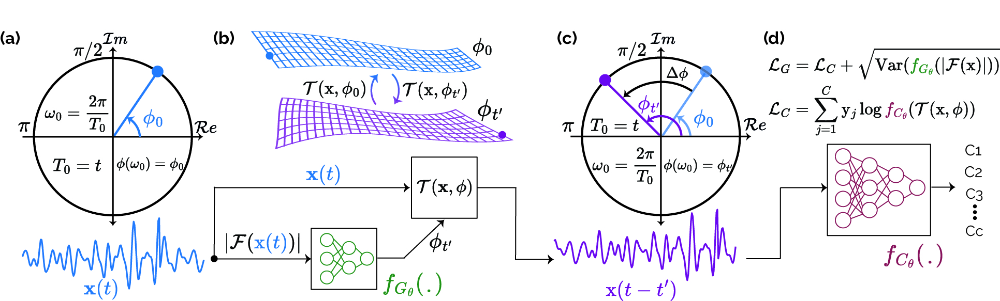

# Shift-invariant Deep learning for Time-series


## Shifting the Paradigm: A Diffeomorphism Between Time Series Data Manifolds for Achieving Shift-Invariancy in Deep Learning (ICLR 2025, Official Code)

Berken Utku Demirel, Christian Holz<br/>

<p align="center">
</p>

---

> Deep learning models lack shift invariance, making them sensitive to input shifts that cause changes in output. While recent techniques seek to address this for images, our findings show that these approaches fail to provide shift-invariance in time series.
 Worse, they also decrease performance across several tasks. In this paper, we propose a novel differentiable bijective function that maps samples from their high-dimensional data manifold to another manifold of the same dimension, without any dimensional reduction. Our approach guarantees that samples--when subjected to random shifts--are mapped to a unique point in the manifold while preserving all task-relevant information without loss.
 We theoretically and empirically demonstrate that the proposed transformation guarantees shift-invariance in deep learning models without imposing any limits to the shift.
 Our experiments on six time series tasks with state-of-the-art methods show that our approach consistently improves the performance while enabling models to achieve complete shift-invariance without modifying or imposing restrictions on the model's topology.
<p align="center">
  
</p>

<p align="center">
  (a) An input signal in the time domain and complex plane representation of its decomposed sinusoidal of frequency $\omega_0 = \frac{2\pi}{T_0}$ with the phase angle $\phi_0$.  
  (b) Guiding the diffeomorphism to map samples between manifolds.  
  (c) The obtained waveform with a phase shift applied to all frequencies linearly, calculated by the angle difference without altering the waveform.  
  (d) The loss functions for optimizing networks with the cross-entropy and the variance of possible manifolds.
</p>


Contents
----------

* [Datasets](#datasets)
* [Running](#running)
* [TLDR](#tldr)
* [Citation](#citation)
* [Credits](#credits)

Datasets
----------
1. Datasets
- `Activity recognition`  [UCIHAR](https://archive.ics.uci.edu/dataset/240/human+activity+recognition+using+smartphones), [HHAR](https://archive.ics.uci.edu/dataset/344/heterogeneity+activity+recognition), [USC](https://dl.acm.org/doi/pdf/10.1145/2370216.2370438).
- `Heart rate prediction`  [IEEE SPC22](https://signalprocessingsociety.org/community-involvement/ieee-signal-processing-cup-2015), [DaLiA](https://archive.ics.uci.edu/dataset/495/ppg+dalia).
- `Cardiovascular disease (CVD) classification`  [CPSC2018](http://2018.icbeb.org/Challenge.html), [Chapman](https://digitalcommons.chapman.edu/scs_articles/653/).
- `Sleep stage classification` [Sleep-EDF](https://www.physionet.org/content/sleep-edf/1.0.0/)
- `Step counting` [Clemson](https://sites.google.com/view/rmattfeld/pedometer-dataset)
- `Lung audio classification` [Respiratory@TR](https://data.mendeley.com/datasets/p9z4h98s6j/1)
  
2. After downloading the raw data, they should be processed with the corresponding [scripts](https://github.com/eth-siplab/Finding_Order_in_Chaos/tree/main/raw_data_process), if there is any.

Running
----------

The command to run with the guidance network
```
python main_supervised_baseline.py --dataset 'ieee_big' --backbone 'resnet' --block 8 --lr 5e-4 --n_epoch 999 --cuda 0 --controller
```

straightforward running without anything
```
python main_supervised_baseline.py --dataset 'ieee_big' --backbone 'resnet' --block 8 --lr 5e-4 --n_epoch 999 --cuda 0
```

with blurring (low-pass):
```
python main_supervised_baseline.py --dataset 'ieee_big' --backbone 'resnet' --block 8 --lr 5e-4 --n_epoch 999 --cuda 0 --blur
```

with polyphase sampling:
```
python main_supervised_baseline.py --dataset 'ieee_big' --backbone 'resnet' --block 8 --lr 5e-4 --n_epoch 999 --cuda 0 --aps
```

with canonicalization:
```
python main_supervised_baseline.py --dataset 'ieee_big' --backbone 'resnet' --block 8 --lr 5e-4 --n_epoch 999 --cuda 0 --cano
```

without the guidance network while including the introduced transformation, one of the ablations in the paper:
```
python main_supervised_baseline.py --dataset 'ieee_big' --backbone 'resnet' --block 8 --lr 5e-4 --n_epoch 999 --cuda 0 --phase_shift
```


TLDR
----------
The animation below shows the main idea of our introduced transformation. 


Citation
----------
If you find our paper or codes useful, please cite our work:

    @inproceedings{
    demirel2025shifting,
    title={Shifting the Paradigm: A Diffeomorphism Between Time Series Data Manifolds for Achieving Shift-Invariancy in Deep Learning},
    author={Berken Utku Demirel and Christian Holz},
    booktitle={The Thirteenth International Conference on Learning Representations},
    year={2025},
    url={https://openreview.net/forum?id=nibeaHUEJx}
    }

Credits
--------

Canonicalization is adapted from [equiadapt library to make neural network architectures equivariant](https://equiadapt.readthedocs.io/en/latest/)

 
